# aihelper — AI-native development runtime

[]()
[]()
[]()
[](https://github.com/vietnguyen2914/aihelper/stargazers)
[](https://github.com/vietnguyen2914/aihelper/issues)
[](https://github.com/vietnguyen2914/aihelper/commits)

> **📖 See [docs/INSTALLATION.md](docs/INSTALLATION.md) for complete setup guide.**  
> **Stop sending giant prompts.** aihelper is an AI-native semantic runtime for low-latency coding assistants.

Replace giant repo scans, 50K-token prompts, cold Python startups, and hallucinated rewrites with semantic routing, compact context, a daemonized hot runtime, and patch-first editing.

**Context-centric, not model-centric:** retrieval > semantic routing > editor awareness > model size.

---

## Demo Workflows

<table width="100%">
  <thead>
    <tr>
      <th width="24%">Workflow</th>
      <th width="76%">Preview</th>
    </tr>
  </thead>
  <tbody>
    <tr>
      <td><strong>Bootstrap + Doctor</strong><br>30s onboarding</td>
      <td>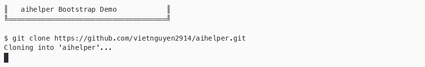</td>
    </tr>
    <tr>
      <td><strong>Semantic Routing</strong><br>95% smaller context, 0.7ms latency</td>
      <td>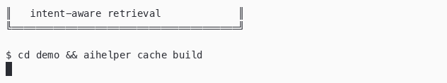</td>
    </tr>
    <tr>
      <td><strong>Patch Planning</strong><br>AST-aware patches with confidence scoring</td>
      <td>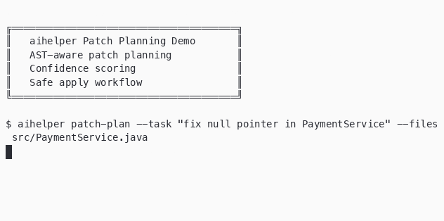</td>
    </tr>
    <tr>
      <td><strong>Diagnostics → Patch</strong><br>Compiler errors → semantic fix flow</td>
      <td>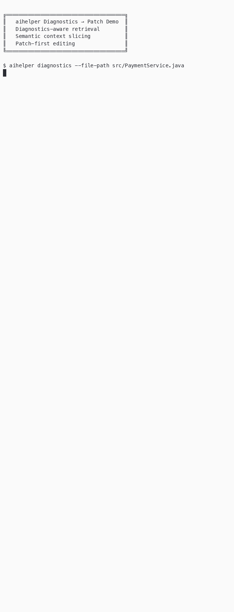</td>
    </tr>
    <tr>
      <td><strong>OCR Screenshot Parse</strong><br>Multimodal orchestration pipeline</td>
      <td>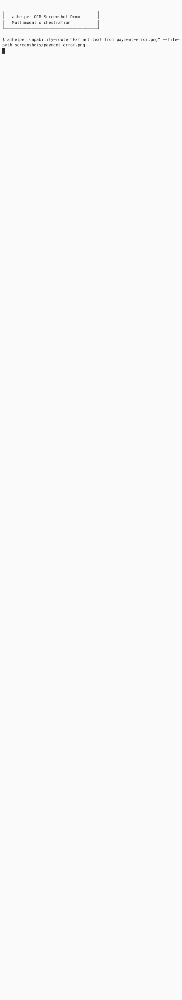</td>
    </tr>
  </tbody>
</table>

---

## Example Flow

Compiler error → diagnostics → semantic routing → compact context → patch plan → confidence scoring → safe apply.

```bash
aihelper diagnostics --file-path src/UserService.php
aihelper route "fix TypeError in UserService.getUser"
aihelper context "fix TypeError in UserService.getUser" --max-context-chars 6000
aihelper patch-plan "add null guard" --file src/UserService.php
aihelper confidence --patch-file fix.patch --files src/UserService.php
aihelper safe-apply --patch-file fix.patch --files src/UserService.php --auto-apply
```

---

## Quick Start

```bash
# 1. Clone
git clone https://github.com/vietnguyen2914/aihelper.git
cd aihelper

# 2. Bootstrap (prerequisites check + env setup)
bash scripts/bootstrap.sh

# 3. Verify installation
./bin/aihelper doctor

# 4. Use on any project
cd /path/to/your/project
aihelper cache build
aihelper route "fix payment bug"
```

> **No Ollama? No problem.** aihelper works without local models — core features (routing, context, symbols, diagnostics, patch planning) are model-free. Models enhance capability but are **optional**.

> **Minimal footprint:** Python 3.9+, macOS/Linux, ~15GB disk for full model stack.  
> **Cloud-only mode:** Use aihelper purely as a context orchestrator with your preferred cloud model.

---

## Who is aihelper for?

- **AI-assisted developers** who want sub-millisecond context instead of 50K-token prompts
- **Developers frustrated by giant AI prompts** and slow context gathering
- **Local-first coding workflows** — works fully offline, cloud models are optional
- **MCP users** tired of 10+ heavy servers — aihelper replaces them with 4 lightweight tools
- **Zed / Codex / Claude / Gemini / VSCode / OpenCode power users** — unified MCP across all editors
- **Large monorepos** — symbol graph + dependency graph instead of full repo scans
- **Teams optimizing AI latency and cost** — 95%+ token reduction, 0.3ms IPC
- **Vietnamese-first teams** that need multilingual local workflows without giving up English tooling

---

## Why aihelper?

Most AI coding tools rely on **giant prompts**, **full repo scans**, and **opaque orchestration**.  
Results: slow agents, token waste, hallucinated edits.

aihelper takes a different approach:

| Traditional AI IDEs | aihelper |
|-------------------|----------|
| Full repo scan → 50K+ tokens | Semantic routing → 750 tokens |
| Cold Python startup (163ms+) | Persistent daemon (0.3ms IPC) |
| Raw file rewrites | Patch planning + confidence scoring |
| Single IDE lock-in | 6 editors, unified MCP |
| Cloud-dependent | Fully offline capable |

### Benchmarks (M1 Pro 32GB)

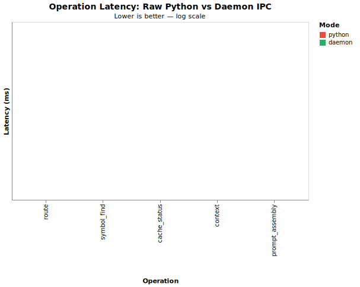

| Operation | Raw Python | Via Daemon | Reduction |
|-----------|-----------|------------|-----------|
| `route` | 163ms | **0.7ms** | 99.6% |
| `symbol_find` | 163ms | **3.1ms** | 98.1% |
| `cache_status` | 163ms | **0.3ms** | 99.8% |
| `context` | 163ms | **0.5ms** | 99.7% |
| Prompt assembly | 500ms+ | **<100ms** | 80%+ |

### Token Efficiency

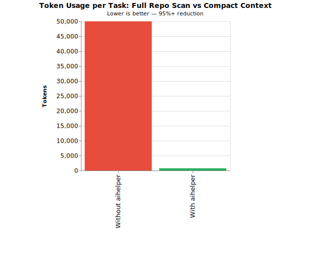

| Without aihelper | With aihelper |
|-----------------|---------------|
| 50K+ tokens (full repo scan) | 750 tokens (compact context) |
| 163ms Python startup per call | 0.3ms daemon IPC |
| 10-20 tool calls per task | 2-3 targeted calls |

### Runtime Shape

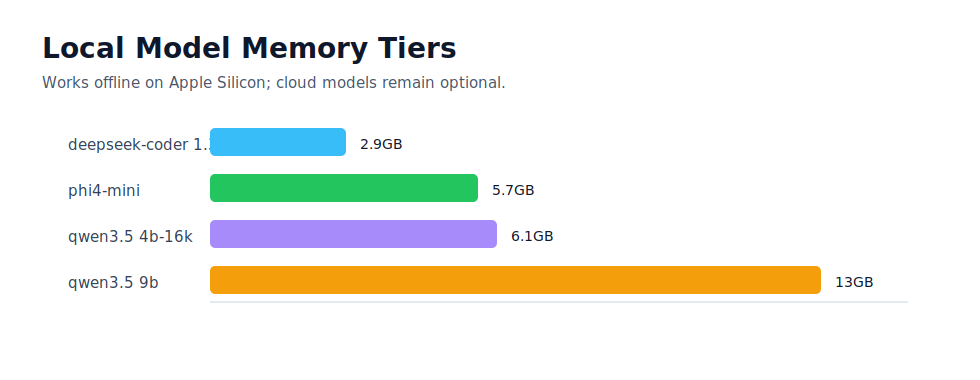

---

## Visual Overview

| Traditional | aihelper |
|---|---|
| Scan 5,000 files | Route 7 symbols |
| Send 50K tokens | Send 750 tokens |
| Cold start every call | Persistent daemon |
| Rewrite files | Generate validated patch |
| One editor stack | Unified MCP across editors |
| Cloud-only context | Offline-first, cloud optional |

Used successfully on:

- 4,700+ file HIS monorepo
- 47K+ symbol index
- Multi-editor workflows across Zed, Codex, Claude, Gemini, VSCode, and OpenCode
- Vietnamese and English project documentation flows

See [docs/comparisons.md](docs/comparisons.md) for detailed comparisons.

---

## Screenshots

| Surface | Preview |
|---|---|
| Doctor output | 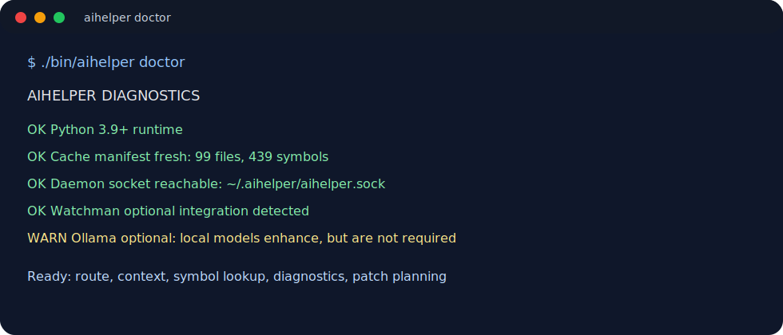 |
| Semantic routing output | 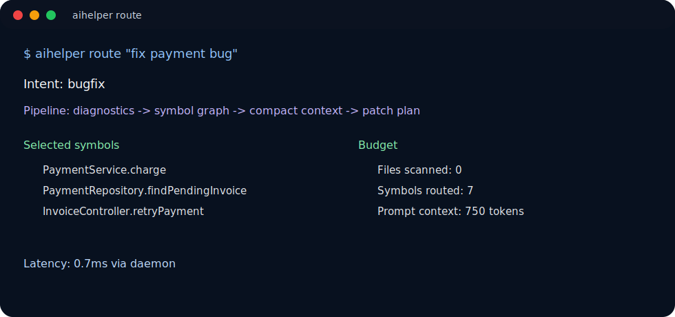 |
| Telemetry summary | 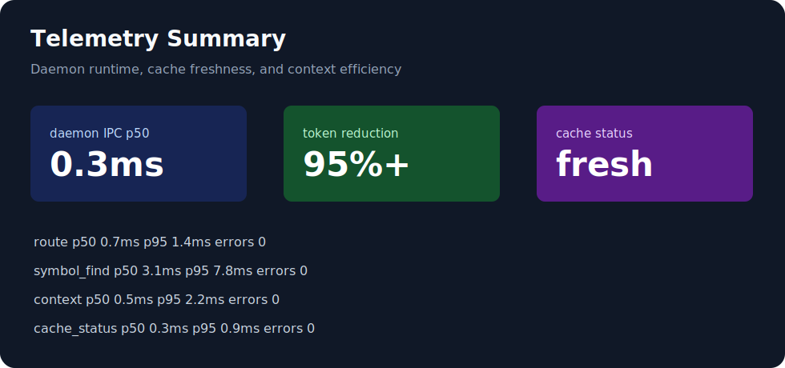 |
| Zed integration | 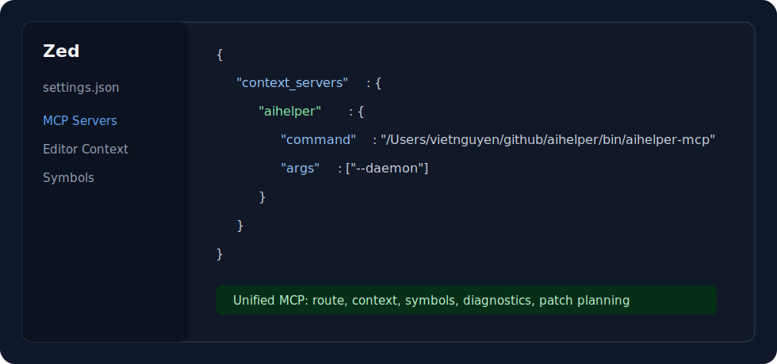 |

---

## Workflow Examples

| Workflow | Steps | Try it |
|----------|-------|--------|
| **Fix compiler error** | diagnostics → routing → patch plan → confidence → safe apply | [Workflow](docs/workflows/fix-compiler-error.md) |
| **Analyze repository** | cache build → symbol graph → intent routing → context | [Workflow](docs/workflows/analyze-repo.md) |
| **Fix PHP bug** | 7-step semantic routing + patch planning | [Example](docs/examples/fix-php-bug.md) |
| **Parse screenshot** | Vision → OCR → structured extraction | [Example](docs/examples/parse-screenshot.md) |
| **Generate presentation** | Mermaid → Marp → PPTX | [Example](docs/examples/generate-presentation.md) |

---

## Commands

Full reference: [docs/commands.md](docs/commands.md)

### Core (get started fast)
```bash
aihelper doctor                  # Verify installation
aihelper cache build             # Index your project
aihelper route "fix bug"         # Route task to optimal tools
aihelper daemon start            # Zero-latency background runtime
```

### Key capabilities
```bash
aihelper diagnostics --file-path src/Main.java    # Compiler errors → fix
aihelper structural-diff --patch-file patch.diff  # AST-aware analysis
aihelper editor-context                           # Detect active editor/file
aihelper telemetry                                # Daemon metrics
```

---

## Features

### 🔥 Daemon (Zero Latency)
- Persistent Unix socket (`~/.aihelper/aihelper.sock`), 49 method handlers in-memory
- Auto-fallback to direct Python if daemon unavailable

### 🧠 Semantic Indexing
- Symbol graph (47K+ symbols), dependency graph, SQL schema summaries
- Semantic fingerprints (formatting-only changes ignored), Watchman-backed incremental refresh

### 🎯 Intent-Aware Routing
Routes by **coding intent**, not file path: `bugfix` → error traces + tests, `refactor` → callers + interfaces, `schema_migration` → DB schemas + migrations, `optimization` → hot paths + profiling

### ✏️ Patch-Based Editing
- Unified diff + git apply validation, 5-factor confidence scoring
- Structural diff plus safe auto-apply with rollback snapshots

### 🧩 Cross-Editor Integration
| Editor | Method |
|--------|--------|
| Zed | Native MCP via `settings.json` |
| Claude Desktop | Native MCP |
| Gemini/Antigravity | Native MCP |
| Codex | Plugin config |
| OpenCode | MCP config |
| VSCode | Roo-Cline / Continue.dev |

### 👁️ Capability Router + Document Pipeline
Parse screenshots, OCR PDFs, rerank context, and generate presentations locally.
- Vision/OCR: `minicpm-v`, `PaddleOCR`
- Docs/data: Mermaid, DBML, Vega-Lite, Marp, PPTX

---

## Model Stack

| Tier | Model | RAM | Role |
|------|-------|-----|------|
| ⚡ Realtime | `deepseek-coder:1.3b` | 2.9GB | Autocomplete, inline |
| ⚡ Realtime | `phi4-mini:latest` | 5.7GB | Assistant, automation |
| ⚡ Realtime | `qwen3.5:4b-16k` | 6.1GB | Semantic edits, patch |
| 🟡 Medium | `deepseek-coder-v2:16b` | ~10GB | Coding fallback (MoE) |
| 🟡 Medium | `qwen3.5:9b` | ~13GB | Vietnamese, general |
| ☁️ Cloud | DeepSeek V4 Pro / GPT-5.5 / Gemini | ∞ | Architecture, complex |

Cloud-only mode: use aihelper purely as a context orchestrator — no local models needed.

Works fully offline on Apple Silicon laptops when you use the local model stack.

---

## Architecture


---

## Runtime Map

```
Editor (Zed / Codex / VSCode / Gemini / Claude / OpenCode)
    ↓
Unified MCP (git, fetch, context7, aihelper)
    ↓
aihelper Daemon (Unix socket, 49 handlers)
    ├── Semantic Scheduler
    ├── Symbol / Dependency Graph
    ├── Patch Planner + Confidence Engine
    ├── Intent Router
    ├── Editor Awareness
    ├── LSP Bridge
    ├── Capability Router
    ├── Document Pipeline
    ├── Telemetry + Subsystem Health
    └── Cache Persistence (RAM → SSD)
```

---

## Requirements

- **Minimal:** Python 3.9+, macOS/Linux, ~15GB disk for full model stack
- **Optional:** Watchman (cache watching), Ollama (local models), Pandoc/LibreOffice (document export)

---

## Roadmap

See [ROADMAP.md](ROADMAP.md) for completed phases (v0.1–v0.5) and future plans.

---

## Community

- [Contributing](CONTRIBUTING.md) — report issues and contribute workflow-focused improvements
- [Changelog](CHANGELOG.md) — release history and upcoming changes
- [Launch playbook](docs/community/launch-playbook.md) — public messaging and content cadence
- [Release notes](docs/releases/v0.6.0.md) — v0.6.0 highlights and launch assets

---

## Comparisons

See [docs/comparisons.md](docs/comparisons.md) for aihelper vs Cursor, Cline, Windsurf, and raw MCP stacks.

---

## Support

If aihelper improves your workflow, consider supporting:
- ⭐ Star the repo
- 🐛 Report issues / suggest features
- ☕ If aihelper saves you time or reduces token costs, consider [buying me a coffee](https://ko-fi.com/vietnguyen2914)
- 💼 Sponsor ongoing development through [GitHub Sponsors](https://github.com/sponsors/vietnguyen2914)

---

## License

MIT
