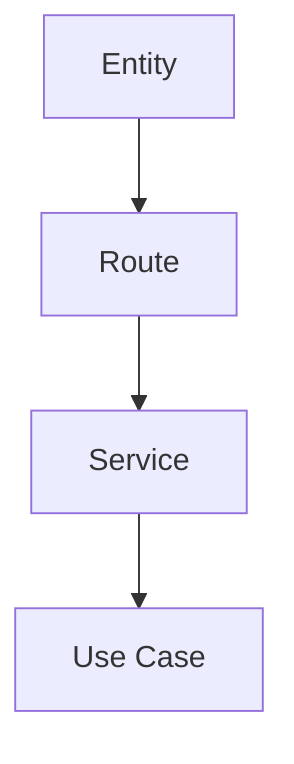

# Entity / Route Matrix

## Purpose

This doc maps important entities and routes to the business use cases that depend on them.

## Template

| Entity / Route | Use Case | Ownership | Notes |
|---|---|---|---|
| `<entity>` | `<use case>` | `<core/admin/ops>` | `<relationship or constraint>` |

## Mermaid Flow

