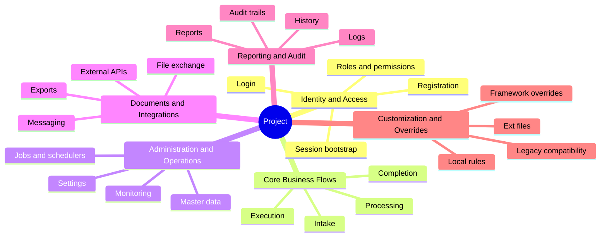

# Function Mindmap

## How To Use It

- Replace the branch labels with the actual top-level business groups from the project.
- Keep the top level small enough to read on one screen.
- Prefer use-case names over internal module names.

