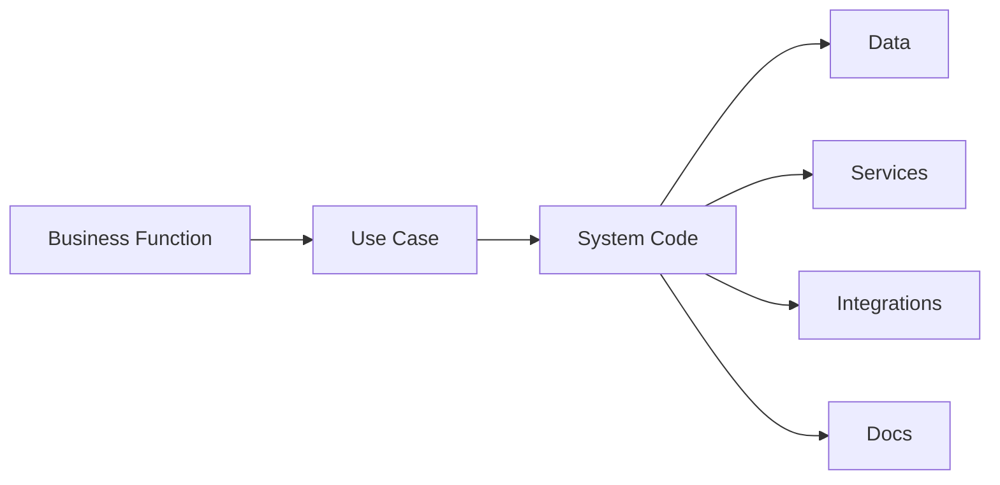

# Function / Use Case vs System Matrix

## Purpose

This matrix maps each business function and use case to the code, routes, tables, services, jobs, and docs that implement it.

## Matrix Template

| Use Case | Entry Point | Core Code | Data | Services | Integrations | Docs |
|---|---|---|---|---|---|---|
| `<use case>` | `<UI/API/job>` | `<controller/service/page>` | `<entities/tables>` | `<service methods>` | `<API/queue/shared service>` | `<use case doc>` |

## Flow View

## Notes

- Keep one row per meaningful use case, not one row per file.
- Add `ext` or override paths when they change the default runtime behavior.

