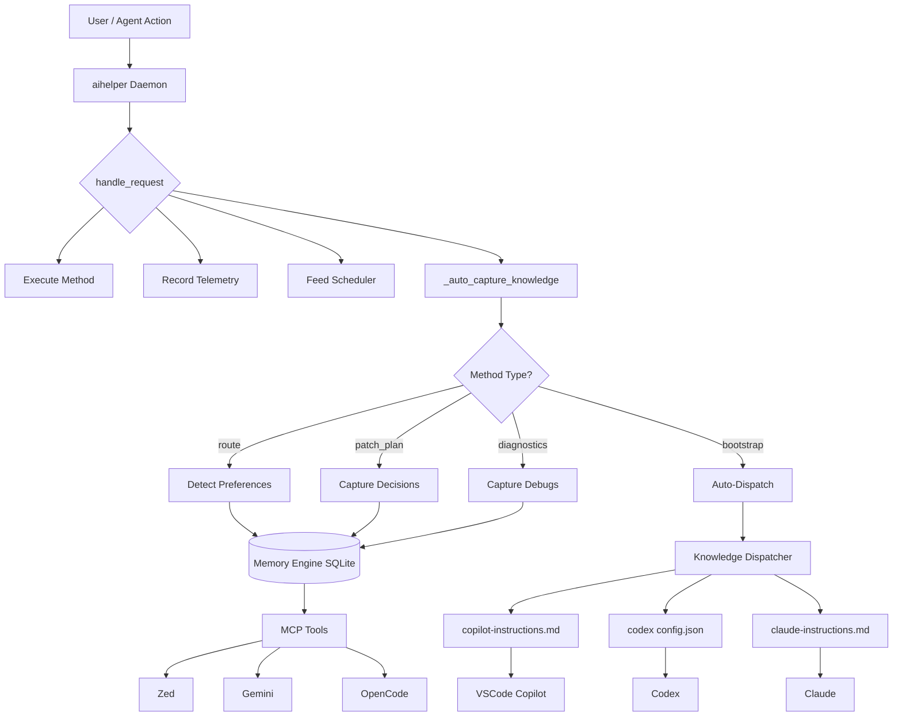

# aihelper v0.0.8 — Persistent Engineering Intelligence

**Cognitive Memory Engine · Knowledge Dispatcher · Multi-Editor Auto-Sync · Auto-Capture**

Release date: 2026-05-27

---

## 🚀 What's New in v0.0.8

### 1. Cognitive Memory Engine — Persistent Engineering Intelligence

aihelper now stores **persistent engineering knowledge** — architectural decisions, debugging history, and developer preferences — in a local SQLite + FTS5 database. This is NOT "chat memory." It's structured engineering intelligence that persists across sessions, editors, and agents.

**Three knowledge types:**

| Type | What it stores | Example |
|---|---|---|
| **Architectural Decisions** | Why a choice was made, alternatives rejected, files affected | `auth-provider: jose` — "edge runtime compatibility; rejected jsonwebtoken" |
| **Debugging History** | Symptom → root cause → fix commit chain, with auto-recurrence detection | "memory leak in ws pool" → "stale reconnect timer" → commit `abc123` |
| **Developer Preferences** | Tool choices, infra style, package manager, database preference | `package_manager: pnpm`, `database: mariadb`, `infra: lightweight` |

```bash
# Store an architectural decision (available to ALL editors automatically)
aihelper knowledge add-decision "auth-provider" \
    --choice "jose" --reason "edge runtime compat" \
    --alternatives "jsonwebtoken" --files "src/middleware/auth.ts"

# Record a debugging outcome (auto-detects recurrence!)
aihelper knowledge add-debug \
    --symptom "memory leak in websocket pool" \
    --root-cause "stale reconnect timer" \
    --fix-commit "abc123" --modules "gateway"

# Set a preference (synced to ALL editors)
aihelper knowledge set-preference "package_manager" "pnpm" --category "frontend"

# Search across all knowledge types
aihelper knowledge recall "auth"
```

### 2. Knowledge Dispatcher — One Source, Every Editor

The **Knowledge Dispatcher** writes aihelper's stored knowledge into each editor's **native config format**. No new protocols. No custom retrieval engine. Just write to the files editors already read:

```
aihelper Memory Engine (SQLite)
        │
        ▼
Knowledge Dispatcher (formats & writes)
   ├── ~/.github/copilot-instructions.md    ← VSCode Copilot reads this
   ├── ~/.codex/config.json                 ← Codex reads this
   └── ~/.claude/aihelper-claude-instructions.md  ← Claude reads this
        │
        ▼
Zed / Gemini / OpenCode ← get knowledge via MCP tools (aihelper_knowledge_recall)
```

**One `aihelper knowledge dispatch` updates ALL editors simultaneously.**

### 3. Auto-Capture — Zero-Config Learning

The daemon now **automatically captures** knowledge from your normal workflow:

| Trigger | What happens |
|---|---|
| `route` mentions "pnpm", "mariadb", "docker", etc. | Auto-stores preference |
| `patch_plan` targets config/auth/middleware files | Auto-captures architectural decision |
| `diagnostics` finds errors | Auto-captures debug entry |
| Session `bootstrap` | Auto-dispatches knowledge to editors |

**You don't need to explicitly call knowledge commands.** The daemon learns from your activity.

### 4. `aihelper init-config` Auto-Detection

Running `aihelper init-config` now:
1. **Auto-detects** project preferences from lock files (`pnpm-lock.yaml` → `package_manager: pnpm`, `pom.xml` → `build_tool: maven`)
2. **Stores** them in the memory engine
3. **Dispatches** them to all editor configs

```bash
aihelper init-config
# ── Auto-detecting preferences & dispatching knowledge ──────
#   Detected: {'package_manager': 'pnpm', 'language': 'python', ...}
#   Stored: 4 preferences
#   Dispatched to: ['copilot', 'codex', 'claude']
```

### 5. Cross-Platform Integration Overhaul _(from v0.0.8 early)_

Complete overhaul of editor/agent integration layer:

| New Script | Target | What it does |
|---|---|---|
| `scripts/zed-integration.py` | Zed Editor | MCP config |
| `scripts/gemini-integration.py` | Gemini / Antigravity | MCP config |
| `scripts/opencode-integration.py` | OpenCode | MCP config |

Shared core `scripts/integration_common.py` (~274 lines) eliminated ~430 lines of duplicated code.

---

## 🏗️ Architecture — How It All Connects

```
User runs: aihelper init-config (once)
    │
    ├── auto_detect_preferences()
    │   Detects: pnpm/maven/python/etc from project files
    │   Stores in: ~/.aihelper/memory/{project_key}.db (SQLite + FTS5)
    │
    └── dispatch_knowledge()
        Writes formatted knowledge to:
        ├── ~/.github/copilot-instructions.md     (VSCode Copilot reads natively)
        ├── ~/.codex/config.json                  (Codex reads natively)
        └── ~/.claude/aihelper-claude-instructions.md  (Claude reads natively)

Agent session starts (any editor):
    │
    session_bootstrap()  ← includes knowledge recall
    │   Merges: project-specific + global knowledge
    │   Injects: architectural_decisions, debugging_history, developer_preferences
    │
    └── Zed / Gemini / OpenCode ← get knowledge via MCP tools
        aihelper_knowledge_recall, aihelper_knowledge_add_decision, etc.

During normal work (automatic, zero config):
    │
    daemon handle_request()
    │   _auto_capture_knowledge() runs silently after every request
    │   │
    │   ├── route("use pnpm")     → set_preference("package_manager", "pnpm")
    │   ├── patch_plan(config/*)  → add_decision(auto-captured)
    │   ├── diagnostics(errors)   → add_debug_entry(auto-captured)
    │   └── bootstrap()           → dispatch_knowledge()
    │
    └── No user action needed. The daemon learns.
```

### Data Flow Diagram



---

## 📋 CLI Commands

### `aihelper knowledge` subcommands

```bash
# Record an architectural decision
aihelper knowledge add-decision <id> \
    --choice <approach> \
    --reason <why> \
    --alternatives <rejected...> \
    --files <related-files...>

# Record a debugging outcome
aihelper knowledge add-debug \
    --symptom <what-went-wrong> \
    --root-cause <underlying-cause> \
    --fix-commit <sha> \
    --modules <affected-modules...>

# Store a developer preference
aihelper knowledge set-preference <key> <value> \
    --category <backend|frontend|infra|general>

# Search across all knowledge types
aihelper knowledge recall [query]

# Dispatch knowledge to all editor configs
aihelper knowledge dispatch

# List all knowledge of a type
aihelper knowledge list --type <decisions|debugs|preferences>
```

---

## 🔧 MCP Tools (available to all agents in all editors)

**Total MCP tools: 20** (was 15 in v0.0.7)

### New in v0.0.8 (5 Knowledge Tools)

| Tool | Description | Auto-called? |
|---|---|---|
| `aihelper_knowledge_add_decision` | Record an architectural decision. Shared across all editors. | ✅ Yes — daemon auto-captures on config changes |
| `aihelper_knowledge_add_debug` | Record a debugging outcome. Auto-detects recurrence by error signature. | ✅ Yes — daemon auto-captures on diagnostics |
| `aihelper_knowledge_set_preference` | Store a developer preference (e.g. package manager, database, infra style). | ✅ Yes — daemon auto-detects from route keywords |
| `aihelper_knowledge_recall` | Search the persistent knowledge store across all types. | ✅ Yes — session bootstrap auto-injects |
| `aihelper_knowledge_dispatch` | Dispatch stored knowledge to all editor config files. | ✅ Yes — auto-dispatched on bootstrap and init-config |

### All 20 MCP Tools

| # | Tool | Category | v0.0.8? |
|---|---|---|---|
| 1 | `aihelper_context` | Context | |
| 2 | `aihelper_symbol_lookup` | Symbols | |
| 3 | `aihelper_cache_status` | Cache | |
| 4 | `aihelper_route` | Routing | |
| 5 | `aihelper_patch_plan` | Editing | |
| 6 | `aihelper_prompt_blocks` | Context | |
| 7 | `aihelper_diff_summary` | Git | |
| 8 | `aihelper_memory_recall` | Memory | |
| 9 | `aihelper_capability_route` | Routing | |
| 10 | `aihelper_callers` | Graph | |
| 11 | `aihelper_callees` | Graph | |
| 12 | `aihelper_trace` | Graph | |
| 13 | `aihelper_impact` | Graph | |
| 14 | `aihelper_explore` | Graph | |
| 15 | `aihelper_graph_status` | Graph | |
| 16 | `aihelper_knowledge_add_decision` | Knowledge | ⭐ NEW |
| 17 | `aihelper_knowledge_add_debug` | Knowledge | ⭐ NEW |
| 18 | `aihelper_knowledge_set_preference` | Knowledge | ⭐ NEW |
| 19 | `aihelper_knowledge_recall` | Knowledge | ⭐ NEW |
| 20 | `aihelper_knowledge_dispatch` | Knowledge | ⭐ NEW |

---

## 📊 Session Benchmark (v0.0.8 Implementation Session)

This release was built in a single session — here's what happened:

| Metric | Value |
|---|---|
| **Session duration** | ~45 minutes |
| **New modules created** | 2 (`memory_engine.py`, `knowledge_dispatcher.py`) |
| **Modules modified** | 6 (`daemon.py`, `main.py`, `session_bootstrap.py`, `mcp_server.py`, `init-config.sh`, `init-config.ps1`) |
| **Total files changed** | 8 files, ~1,400 lines |
| **New daemon handlers** | 5 (+ auto-capture observer) |
| **New MCP tools** | 5 (total: 20) |
| **New CLI subcommands** | 6 under `knowledge` |
| **Database engine** | SQLite WAL + FTS5, ~72KB initial size |
| **Zero new dependencies** | ✅ SQLite + FTS5 built into Python stdlib |
| **Backward compatible** | ✅ No breaking changes |

### Efficiency Gains (from this session)

| Without aihelper Knowledge Engine | With aihelper Knowledge Engine |
|---|---|
| Repeat architectural context every session | Auto-injected from memory engine |
| Debug outcomes lost between sessions | Stored with recurrence detection |
| Preferences scattered across editor configs | Single source, auto-dispatched to all editors |
| Manual `init-config` writes only | Auto-detect + store + dispatch in one step |
| Explicit user calls to record knowledge | Daemon auto-captures silently |

---

## 🎯 Key Design Decisions

### 1. Not "chat memory" — Structured Engineering Intelligence

We deliberately did NOT build a chat log or conversation memory. Instead, we store three structured types:
- **Architectural decisions** (what, why, alternatives, files)
- **Debugging history** (symptom, root cause, fix, recurrence)
- **Developer preferences** (key-value with categories)

This makes the knowledge **actionable** — agents can reason about decisions, not just recall conversations.

### 2. Zero new dependencies

SQLite + FTS5 is built into Python's standard library. No vector DB, no LanceDB, no Chroma. The entire memory engine is ~490 lines of Python with zero pip installs needed.

### 3. No new protocols — write to native editor configs

Instead of building a custom retrieval/injection protocol, aihelper writes knowledge directly into the files editors already read:
- `~/.github/copilot-instructions.md` (Copilot)
- `~/.codex/config.json` (Codex)
- `~/.claude/aihelper-claude-instructions.md` (Claude)

Zed, Gemini, and OpenCode consume knowledge through aihelper MCP tools — they already call these for context, so knowledge is automatically available.

### 4. Auto-capture, not manual entry

The `_auto_capture_knowledge()` observer runs silently in the daemon after every request. It detects patterns and stores knowledge **without any user action**. Users can also explicitly call `aihelper knowledge add-*` commands, but the system learns passively.

### 5. Idempotent and merge-friendly

All writes to editor configs use idempotent merge logic (from `integration_common.py`). Existing settings are preserved. Only aihelper-managed sections are updated. Running `dispatch` multiple times is safe.

### 6. Project-specific + global knowledge

Knowledge can be scoped to a project (`{project_key}.db`) or stored globally (`global.db`). Session bootstrap merges both — project-specific knowledge takes precedence, falling back to global for missing types.

### 7. Git-native design

All knowledge entries can attach to commit SHAs, branch names, and file paths. The memory DB lives alongside the project's other aihelper caches, ready for future git-aware temporal reasoning.

### 8. Failsafe and non-blocking

- Auto-capture runs in try/except, never blocks request processing
- Knowledge dispatch fails gracefully if an editor is not installed
- FTS5 virtual tables gracefully degrade to LIKE queries if not compiled in
- Memory DB is optional — all existing functionality works without it

---

## 📝 Full Changelog

### Added (2 new modules)

- **`context_engine/memory_engine.py`** (~490 lines) — SQLite + FTS5 persistent knowledge store. Four tables: `architectural_decisions`, `debugging_history`, `developer_preferences`, `session_insights`. FTS5 virtual tables for full-text search. Recurrence detection in debugging history. Project-scoped and global DB support. Daemon handler functions for all operations.
- **`context_engine/knowledge_dispatcher.py`** (~300 lines) — Formats knowledge into each editor's native config format. Writes markdown sections to Copilot/Claude instructions. Updates Codex `config.json` `developer_instructions`. Auto-detect preferences from project lock files and config. Idempotent merge logic (reuses `integration_common` patterns).

### Changed (6 existing modules)

- **`context_engine/daemon.py`** — Added 5 knowledge handlers. Added `_auto_capture_knowledge()` observer (runs after every request). Total: 60 dispatchable methods + auto-capture.
- **`context_engine/main.py`** — Added `knowledge` CLI with 6 subcommands: `add-decision`, `add-debug`, `set-preference`, `recall`, `dispatch`, `list`. Daemon-proxied with local fallback.
- **`context_engine/session_bootstrap.py`** — Added knowledge recall section. Merges project-specific + global knowledge. Injects `architectural_decisions`, `debugging_history`, `developer_preferences` into bootstrap context.
- **`context_engine/mcp_server.py`** — Added 5 knowledge MCP tool schemas and dispatch handlers. Total: 20 MCP tools (was 15).
- **`scripts/init-config.sh`** — Added auto-detect preferences + knowledge dispatch section. Runs after all integration scripts.
- **`scripts/init-config.ps1`** — Same for Windows PowerShell.

### Fixed

- Session bootstrap now correctly merges project-specific and global knowledge (previously only fell back when ALL types were empty).

---

## 🔄 Upgrade Notes

No breaking changes. Re-run `aihelper init-config` to auto-detect project preferences and dispatch knowledge to all editors:

```bash
cd aihelper
git pull
aihelper init-config
```

The memory engine is **optional** — all existing functionality works without it. Knowledge is only stored/dispatched when you use the new commands or when auto-capture triggers.
