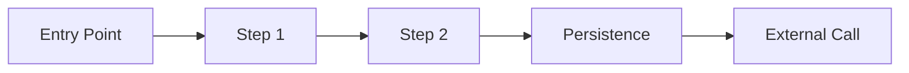

# Workflows

## Purpose

Workflow docs describe the ordered execution path across controllers, services, jobs, integrations, and persistence.

## Required Format

## What To Include

- The business flow name
- The owning feature
- The entry point
- Ordered steps
- Database interactions
- Override points

